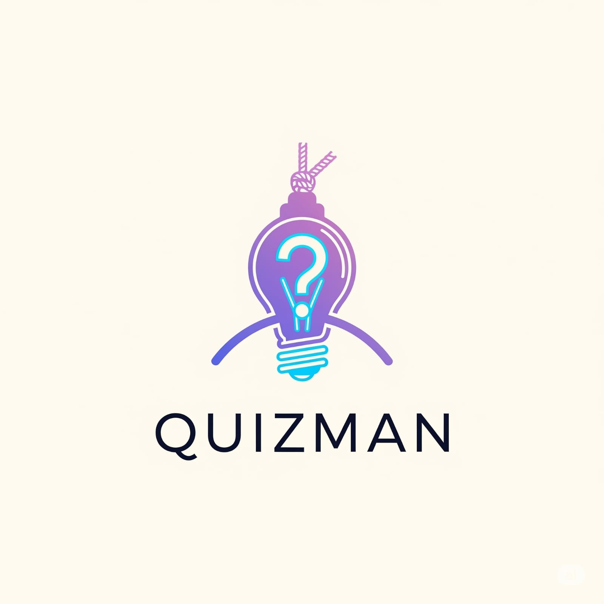

## 🧠 Team & Product 

---

#### 👨‍👩‍👧‍👦 Team Members

| **Name**       | **Title**        | **LinkedIn** |
|----------------|------------------|--------------|
| Zeynep Tek     | Product Owner    | [Zeynep Tek](https://www.linkedin.com/in/zeynep-tek/) |
| Eylül Kaplan   | Scrum Master     | [Eylül Kaplan](https://www.linkedin.com/in/eylulka01/) |
| Melisa Dindar  | Developer        | [Melisa Dindar](http://linkedin.com/in/melisa-dindar-991571246) |

---

#### 🚀 Product

`QuizMan` - QuizMan is a smart, gamified quiz application that challenges your knowledge with AI-generated questions and a hangman twist for every mistake.
---

## 🚀 SPRINTS

### 🏁 SPRINT 1

---

#### 📝 Sprint Notes

- The user will select a **topic** and **difficulty level** via an HTML form.
- Based on this input, relevant quiz questions will be fetched from a **static JSON** file (to simulate AI-generated content).
- In future sprints, questions will be dynamically generated using **Gemini API**.
- A **quiz interface** will be designed to display multiple-choice questions (HTML/CSS).
- The user's answers will be sent to the **FastAPI** backend for **correct/incorrect evaluation**.
- On a wrong answer, a **hangman drawing** will be updated (via JavaScript or `img` tag).
- After a certain number of incorrect answers, a "**Game Over / Hangman Complete**" screen will be shown.
- The quiz question data will be organized in a `.json` file during this stage.

---

#### 🎯 Estimated Sprint Points: `180 Points`

---

#### 🧮 Estimation Breakdown

| Task | Description | Points |
|------|-------------|--------|
| Home & Quiz Start Page | Topic + Difficulty selection | 25 |
| Question API Endpoint | Fetching simulated data from JSON | 30 |
| Quiz Interface | Displaying choices via HTML form | 25 |
| Answer Evaluation | Backend validation | 30 |
| Hangman Drawing | Visual progression on wrong answers | 40 |
| Game Over Screen | Win/Lose display | 30 |
| **Total** |  | **180** |

---

#### 📋 Sprint Board (Trello)

- **Lists**: `To Do`, `In Progress`, `In Review`, `Done`  
- **Sample Cards**:
  - Quiz UI Design  
  - FastAPI Endpoint  
  - JSON Question Data (Simulated AI)  
  - Hangman Visuals  
  - Answer Checking Logic
  
  ---

### ✅ Sprint Review

- The quiz screen was successfully created and displays questions and multiple-choice options.
- A basic hangman drawing mechanism was implemented (drawing progresses with each wrong answer).
- The feature to add favorite questions to the database was successfully implemented.

---

### 🧠 Sprint Retrospective

- Team members who were new to FastAPI and SQL were supported with examples and explanations.
- For this sprint, instead of using Gemini AI, questions were fetched from a static JSON file, which was sufficient for early development.
- The focus was on creating a functional and clean interface. User interaction was prioritized over detailed visuals.

---

### 📅 Sprint Planning

**Objective:**  
To build the core structure of the game and enable users to register and take quizzes.

---

#### 👥 Task Distribution

| Role | Description |
|------|-------------|
| **Backend (2 people)** | Developed login/registration functionality using FastAPI, connected the database, and implemented the favorite system. |
| **Frontend (2 people)** | Created the quiz interface, options UI, and login/register forms using HTML and CSS. |
| **Coordination & UI/UX (1 person)** | Managed communication within the team and planned a simple but effective page layout and user experience. This role was especially helpful for team members new to full-stack development. |
